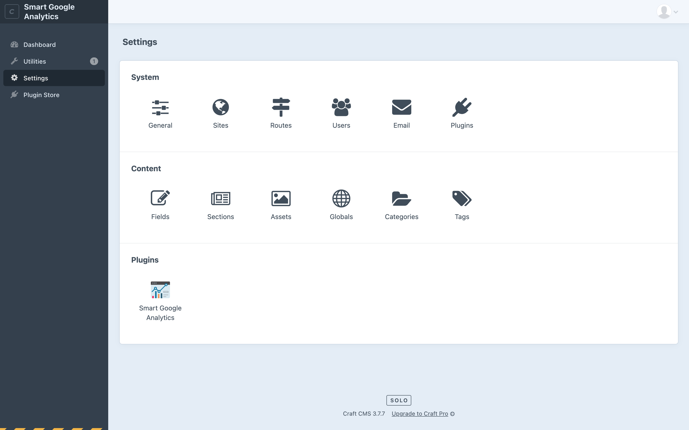
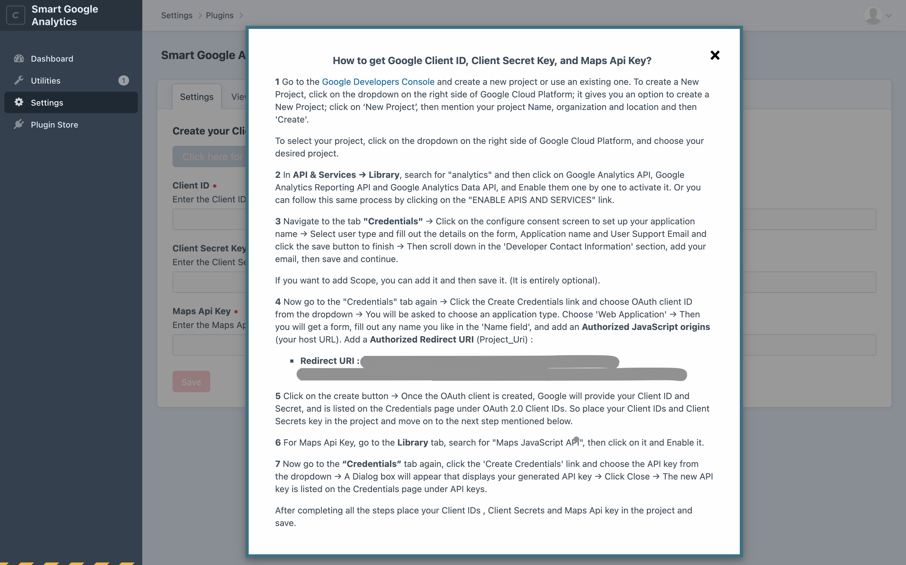
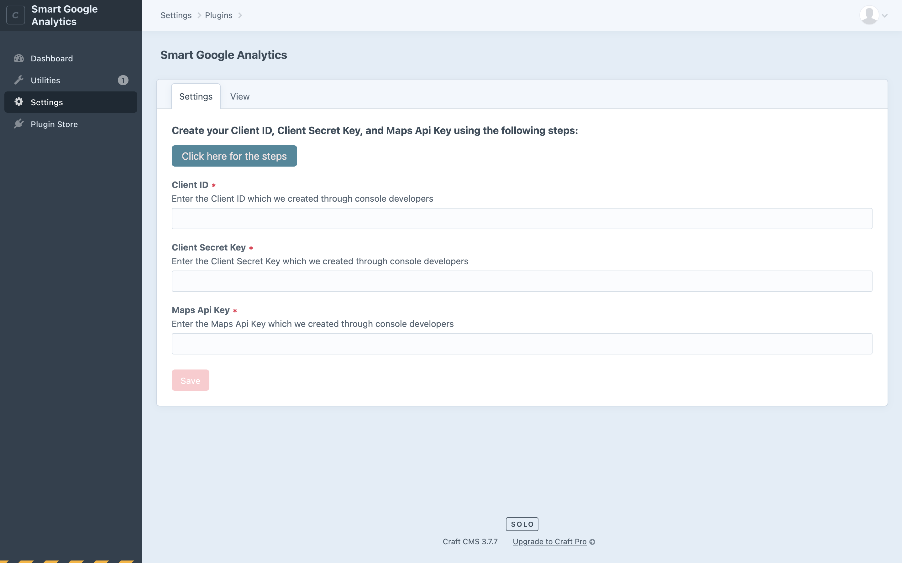
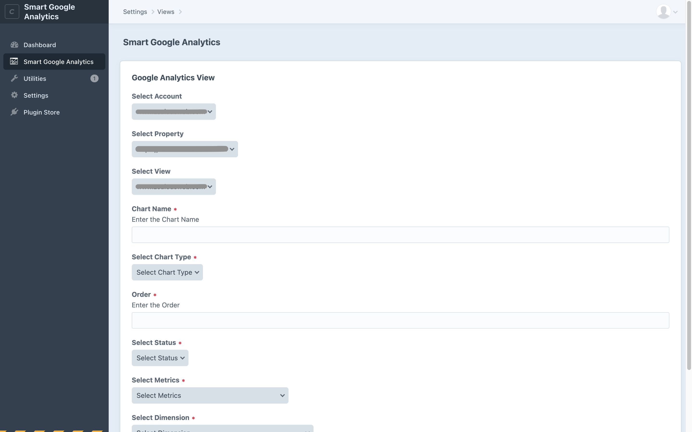
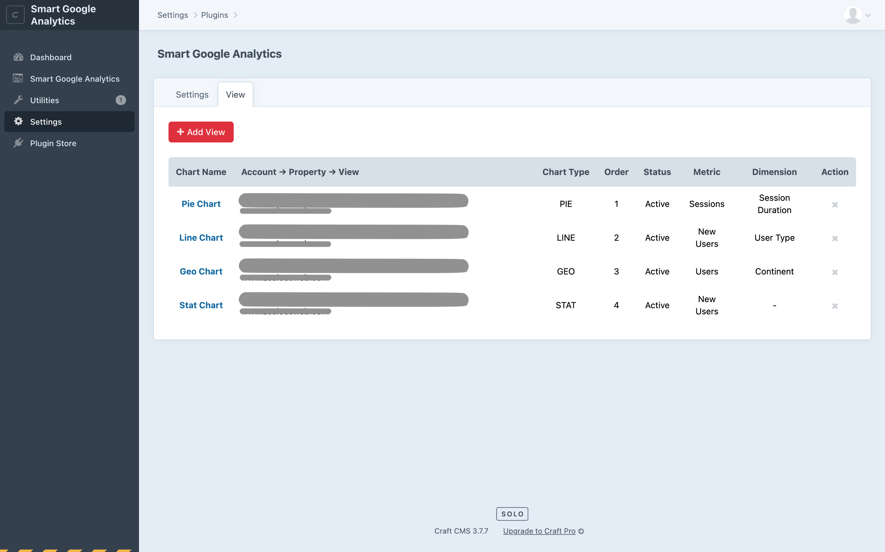
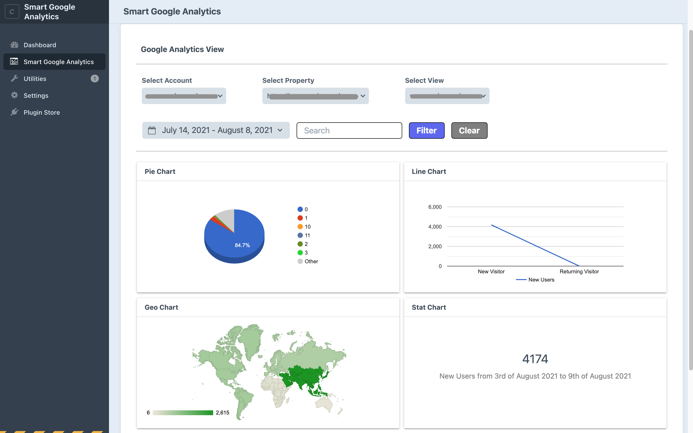

# Smart Google Analytics plugin for Craft CMS 3.x

This plugin provides access to a massive amount of data related to how users find and interact with your site. For example, you can see how many people visited a specific page, how much time they spent there, where your users live, how the specific keywords are performing, and so forth.

## Requirements
The prerequisites for the Smart Google Analytics Plugin to function are: 

1. Craft CMS Version 3.1 to greater
2. PHP Version 7.2.5 or greater

## Installation
You can install this plugin either from the Plugin Store or with Composer.

- **From the Plugin Store (Without Composer):**

    Go to the Plugin Store in your project's Control Panel and search for "Smart Google Analytics". Then click on the "Install" button in its modal window.

- **With Composer:**

```bash
# Go to the project directory
cd /path/to/my-project

# Command the composer to load the plugin
composer require zealouswebcraftcms/smart-google-analytics

# Command the craft to install the plugin
./craft install/plugin smart-google-analytics
```

## Major features of the Plugin:
1. Create multiple views or edit the existing ones.
2. Remove unnecessary views.
3. On the Analytics Dashboard Page, numerous charts will be displayed with the help of Widgets.



















#### **How to generate Client ID and Client Secret Key and Map API Keys:** 

**Step 1**  Create a Project in Google API Console Developers
1. Sign-in to "Google's Developers Console."   
2. Go to the [Google Developers Console](https://console.developers.google.com) and create a new project or use an existing one.
3. To create a New Project, click on the dropdown on the right side of Google Cloud Platform; it gives you an option to create a New Project; click on ‘New Project’, then mention your project Name, organization and location and then 'Create'.
To select your project, click on the dropdown on the right side of Google Cloud Platform, and choose your desired project.

**Step 2** Activate the Google Analytics APIs
- In API & Services → Library, search for "analytics" and then click on Google Analytics API, Google Analytics Reporting API and Google Analytics Data API, and Enable them one by one to activate it. Or you can follow this same process by clicking on the "ENABLE APIS AND SERVICES" link.

**Step 3** Get Your API Keys
To get your API Keys(via Client ID and Client Secret), you have to follow the below steps:
- Navigate to the tab "Credentials".
- Click on the configure consent screen to set up your application name.
- Select user type and fill out the details on the form, Application name and User Support Email and click the save button to finish.
- Then scroll down in the 'Developer Contact Information' section, add your email, then save and continue.
- If you want to add Scope, you can add it and then save it. (It is entirely optional).

Select your Application Type
- Now go to the "Credentials" tab again. 
- Click the Create Credentials link and choose OAuth client ID from the dropdown.
- You will be asked to choose an application type. Choose 'Web Application'.
- Then you will get a form, fill out any name you like in the 'Name field', and add an Authorized JavaScript Origins(your host URL). 
  For example : http://localhost.
- Add an Authorized Redirect URIs(Project_Uri):
  Redirect URI for the particular project is available on the settings page.
- Click on the create button.
- Once the OAuth client is created, Google will provide your client ID and Secret. So place your Client IDs and Client Secrets key in the project and move on to the next step mentioned below.

**Step 4** Get Your Map API Keys
- In API & Services → Library, search for "Maps JavaScript API", then click on it and Enable it.
- Now go to the "Credentials" tab again, click the 'Create Credentials' link and choose the API key from the dropdown.
- A Dialog box will appear that displays your generated API key.
- Click Close.
- The new API key is listed on the Credentials page under API keys.
- Once the API key is created, place your Map API key in the project and save it.

## General Settings:
- To authenticate with Google Analytics Account, you have to put in this Client ID, Client Secret and Maps API Key and then click on the 'Save' button for saving the Credentials. After saving this field, You have to click on the connect button to connect with your Google Console Developer Account.

**Client ID:**
- On the Setting's page, there will be a TextField. You have to put your Client ID in that field which you have created through Google Console Developers.

**Client Secret:**
- On the Settings page, you will find another TextField. You have to put your Client Secret key in the field you have created through Google Console Developers.

**Map API Key:**
- On the Setting's page, there will be another TextField. You have to put your Map API key in the field that you created through Google Console Developers. 

## Usage
- After adding the required information on the settings page, move on to the view tab, where you can create new views.

**Add/Edit Views:**
- Create a view by selecting your analytics profile, chart name, chart type, order, status, metrics and dimension according to your requirement.
- We have managed the dimension field according to various chart types.
  For example: When using a STAT chart, its data is displayed using metrics only; there is no need for dimension to be selected.
- The Order field needs to be unique for all accounts, as this determines the order of the graph to be displayed in the dashboard.
- The status field determines the view displayed on the dashboard by using status Active, InActive.
- Later on, you can edit any view.

**View List:**
- On the list page, you can sort data for particular fields.

**Delete View:**
- On the list page, you can also delete a view.

**Analytics Dashboard Page:**
- On the Analytics Dashboard Page, you can display multiple reports with different Widgets using your view.
- On the Analytics Dashboard Page, you can also filter data.


